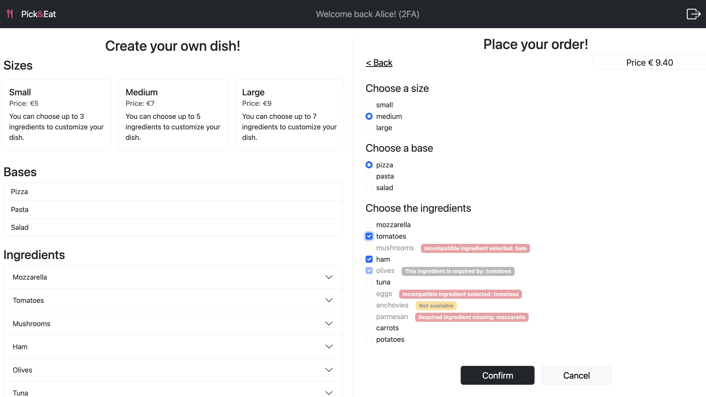

# Exam #2: "Restaurant"
This project was developed during the 2025 edition of the Web Applications course in the Cybersecurity Master's degree at Politecnico di Torino.

## React Client Application Routes
- Route `/`: for a non-authenticated user, it shows the list of bases, sizes and ingredients. If the user is authenticated, it is replaced by `/orders`.
- Route `/orders`: for an authenticated user, on the left it shows the list of ingredients, bases and sizes, while on the right the list of orders.
- Route `orders/new`: for an authenticated user, on the left it shows list of bases, sizes and ingredients, while on the right the form for placing a new order.
- Route `/orders/:id`: for an authenticated user, on the left it shows list of bases, sizes and ingredients, while on the right the list of the order #id (if placed by them).
- Route `/login`: route showing the login/TOTP form.

## API Server
- GET `/api/sizes`
  - Description: it returns the list of dish sizes, with the details (size, price, maxIngredients).
  - Request body: _None_
  - Response: `200 OK` (success) or `500 Internal Server Error` (generic error).
  - Response body:
  ```json
  [{
    "size": "small",
    "price": 5,
    "maxIngredients": 3
  },
  ...]
  ```

- GET `/api/bases`
  - Description: it returns the list of dish bases, with the details (base).
  - Request body: _None_
  - Response: `200 OK` (success) or `500 Internal Server Error` (generic error).
  - Response body:
  ```json
  [{
    "base": "pizza"
  },
  ...]
  ```

- GET `/api/ingredients`
  - Description: it returns the list of ingredients, with the details (name, quantity, prize, requiredIngredient, incompatibilities).
  - Request body: _None_
  - Response: `200 OK` (success) or `500 Internal Server Error` (generic error).
  - Response body:
  ```json
  [{
    "name": "tomatoes",
    "price": 0.5,
    "quantity": null,
    "requires": "olives",
    "incompatibilities": [
      "eggs"
    ]
  },
  ...]
  ```

- GET `/api/orders` (Authenticated API)
  - Description: it returns the list of orders purchased by the user, with the details (id, userId, date, price, size, base, ingredients).
  - Request body: _None_
  - Response: `200 OK` (success), `401 Unauthorized` (no valid session) or `500 Internal Server Error` (generic error).
  - Response body:
  ```json
  [{
    "id": 1,
    "userId": 1,
    "date": "2025-06-30T22:00:00.000Z",
    "price": 6.6,
    "size": "small",
    "base": "pasta",
    "ingredients": [
      "carrots",
      "ham"
    ]
  }
  ...]
  ```
- POST `/api/orders`(Authenticated API)
  - Description: it creates a new order.
  - Request body:
  ```json
  {
    "price": 6.6,
    "base": "pasta",
    "size": "small",
    "ingredients": ["carrots", "ham"]
  }
  ```
  - Response: `201 Created` (success), `401 Unauthorized` (no valid session), `422 Unprocessable entity`(wrong request) or `500 Internal Server Error` (generic database error).
  - Response body:
  ```json
  {
    "id": 1,
    "userId": 1,
    "date": "2025-06-30T22:00:00.000Z",
    "price": 6.6,
    "size": "small",
    "base": "pasta",
    "ingredients": [
      "carrots",
      "ham"
    ]
  }

  ```
- DELETE `/api/orders/:id`(Authenticated API, with TOTP)
  - Description: it deletes the order with the `id` specified in the route.
  - Request body: _None_
  - Response: `200 OK` (success), `401 Unauthorized` (no valid session), `422 Unprocessable entity`(wrong request) or `500 Internal Server Error` (generic database error).
  - Response body:
  ```json
  {
    "numRowChanged": 1
  }
  ```
- POST `/api/sessions`
  - Description: Create a new session starting from given credentials.
  - Request body: An object with username and password
  ```json
  {
    "username": "alice@r.com",
    "password": "alice"
  }
  ```
  - Response: `201 Created` (success) or `401 unauthorized` (generic error).
  - Response body: The object containing the user info in case of success, an error message in case of failure.
  ```json
  {
    "id": 1,
    "username": "alice@r.com",
    "name": "Alice",
     "isTotp": false
  }
  ```
- POST `/api/totp-login`
  - Description: Login with TOTP. A cookie with a VALID SESSION ID must be provided.
  - Request body: An object with the TOTP
  ```json
  {
    "code": "459969"
  }
  ```
  - Response: `200 OK` (success) or `401 unauthorized` (generic error).
  - Response body: The object containing the result of the operation.
  ```json
  {
    "otp": "authorized"
  }
  ```
- GET `/api/sessions/current`
  - Description: Verify if the given session is still valid and return the info about the logged-in user. A cookie with a VALID SESSION ID must be provided to get the info of the user authenticated in the current session.
  - Request body: _None_
  - Response: `200 OK` (success) or `401 Unauthorized` (error).
  - Response body: An object with user information
  ```json
  {
    "id": 1,
    "username": "alice@r.com",
    "name": "Alice",
    "isTotp": false
  }
  ```
- DELETE `/api/sessions/current`
  - Description: Delete the current session. A cookie with a VALID SESSION ID must be provided.
  - Request body: _None_
  - Response: `200 OK` (success) or `500 Internal Server Error` (generic error).
  - Response body: _None_


## Database Tables
- Table `bases`- contains the list of possible bases.
- Table `sizes`- contains the list of possible dish sizes with their prize and maximum number of ingredients.
- Table `ingredients` - contains the list of ingredients, characterized by name (primary key, since it is considered unique), prize, quantity (if specified) and, if present, the required ingredient.
- Table `incompatibilities` - contains the list of incompatible ingredients (stored as a pair of ingredients)
- Table `orders` - contains the list of orders, represented by their unique ID, the user that made them, the total price, the size and the base dish.
- Table `ordersIngredients` - contains the ingredients associated to each order (pairs orderId - ingredient).
- Table `users`- contains the list of users, identified by userId, email, name, salt, hashed password and TOTP secret.


## Main React Components
- `App` (in `App.jsx`): the component that returns the JSX of the whole application. It is rendered inside the `Router` component, and it contains the states related to the bases, sizes, ingredients, orders, user, ...
- `Layout` (in `App.jsx`): the component returning the layout of the page, which means the header, alerts with errors (if present), the actual body of the page (the `Outlet`, replaced by one or two of following components, depending on the route) and the footer.
- `MenuOptions` (in `MenuOptions.jsx`): the component responsible for rendering the list of ingredients, sizes and bases. It is a wrapper for the specific components returning the visualization of each of those lists:
  - `SizesCards` (in `MenuOptions.jsx`): the wrapper for each card object (rendered by `SizeCard`) representing a dish size and its characteristics (price and maximum number of ingredients).
  - `BasesList` (in `MenuOptions.jsx`): the component rendering the list of dish bases.
  - `IngredientsAccordion` (in `MenuOptions.jsx`): the wrapper for each accordion item (rendered by `IngredientAccordionItem`) showing an ingredient and its characteristics (name, quantity, price, required ingredients and incompatibilities).
- `OrdersList` (in `OrdersList.jsx`): the component rendering, for an authenticated user, the table containing their orders.
- `OrdersRow` (in `OrdersList.jsx`): each of the rows in the orders table, reporting the id, date and price of each order. The order details can be visualized by clicking on the info button, and the order can be deleted through the trash button (only if the user is logged in with TOTP).
- `OrderConfigurator`(in `OrderConfigurator.jsx`): the component rendering, for an authenticated user, the form for creating a new order. It prevents the user from choosing an invalid configuration of ingredients/sizes in an order, that is afterwards validated on the server side. Moreover, it is used also to show the details about an order (when clicking on the info button for an order).
- `LoginForm`(in `AuthComponent.jsx`): the component rendering the login form. It is responsible for the client-side validation of the login credentials (non-empty fields).
- `TotpForm`(in `AuthComponent.jsx`): the component rendering the TOTP form. It is responsible for the client-side validation of the TOTP (six-digits string).
- `MyHeader` (in `MyHeader.jsx`): the component rendering the header of the application, containing the name of the application, the name of the user (if logged in) and the login/logout button.
- `MyFooter` (in `MyFooter.jsx`): the component rendering the footer.

## Screenshot



## Users Credentials

- username: alice@r.com, pwd: alice
- username: bob@r.com, pwd: bob
- username: charles@r.com, pwd: charles
- username: dave@r.com, pwd: dave
- username: emily@r.com, pwd: emily
